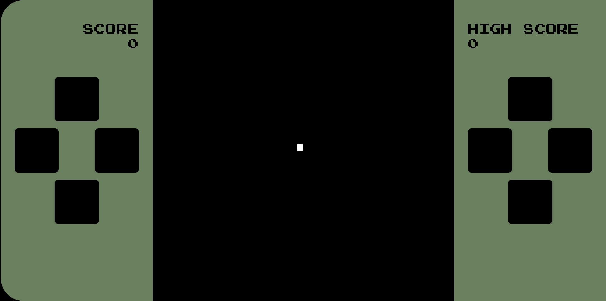

# QR Game

 [](https://codecov.io/gh/SiXoS/qr-game)

Compiler and runtime for the QG language. QG is designed for creating games that can be compiled to a QR code.
The language focuses on small byte code footprint, ease of use and basic type safety.

## Requirements

Requires Java 8 and maven.

## Usage

Compile a program using:
```
mvn install
bin/qgc_source.sh compile code.qg output_qr.png
```

## Performance

The runtime is executed in Java and is therefore slower than Java, about 10-15 times slower.
This might sound a lot but as this language is designed for simple, tiny 2D games it 
should not pose a big issue.

## Security

Since this enables running code directly from a QR-code, security is a concern. The language
is purposely built to have no knowledge of the outside world.

The only "input" that the language has is provided actively by the running device.
This includes execution of the input block and the time since the last frame
executed. The program has a concept of time but "epoch" is at the launch of the game.

The only "output" that the language can produce is a list of objects that should be
drawn. These are polled by the running device.

The only malicious use of this language is hogging resources. The running device should
add some logic to detect this. i.e. if an iteration takes too long to run or if it's using
too much memory.

## Small example
Example UI and code for a small "game". It with a square in the center. 
When you hit a d-pad button the square will move.

### Game UI
This is an image of the game UI. The buttons are static for all games but the behavior is controlled through code.



### Code

```
init {
  position = -1
}

run {
  coords = when(position) {
    0 -> new pos(490, 390)
    1 -> new pos(590, 490)
    2 -> new pos(490, 590)
    3 -> new pos(390, 490)
    default -> new pos(490, 490)
  }
  draw(createRectangle(coords.x, coords.y, 20, 20))
}

input(button, pressedElseReleased) {
  if (pressedElseReleased) {
    position = button % 4
  }
}

struct pos {
  x: number
  y: number
}
```

### QR code
The compiled bytecode is 64 bytes and is stored in the below QR code. The maximum number
of bytes in a QR is 2952.


