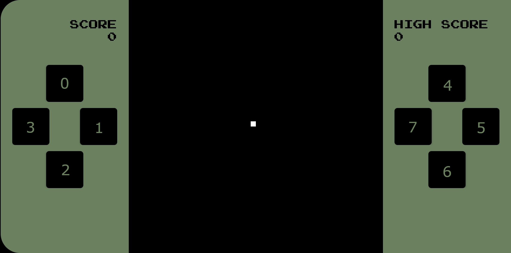
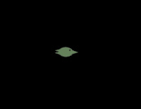

# QR game language

The programming language is designed to be familiar, easy to get into and produce a minimal bytecode footprint.
The syntax is C-like with some concepts taken from kotlin. It is type-inferred and strictly typed.

## Quick-guide for experienced developers

This guide is designed for developers who have experience in one or many languages and want as little repetition as possible.

### Minimal game

Below is an example of a minimal example for a basic "game". The init block runs once on start-up.
The run block runs once per frame. The input block runs once per key press/release. The run and input block
runs synchronously, so you don't need to worry about race conditions or other concurrency issues.

```
init {
  position = -1
}

run {
  coords = when(position) {
    0 -> new pos(490, 390)
    1 -> new pos(590, 490)
    2 -> new pos(490, 590)
    3 -> new pos(390, 490)
    default -> new pos(490, 490)
  }
  draw(createRectangle(coords.x, coords.y, 20, 20))
}

input(button, pressedElseReleased) {
  if (pressedElseReleased) {
    position = button % 4
  }
}

struct pos {
  x: number
  y: number
}
```

### Scope

There are only two scopes: the main scope and the function scope.

The main scope is shared between the init, run and input block.
There's no block-level scope so a variable defined in an if-statement can be accessed outside it.

The function scope is in functions. Functions can only use the variables they have
declared (and the parameters of course).

### Variable types

There are four main variable types: `number`, `bool`, a struct (`pos`) in the example above, an Object (for example `List<number>`)

Numbers are 64-bit floating point numbers.

Objects can only be created using built in functions such as [arrayList()](functions.md#array-list).

Null values has to be typed due to technical reasons (might change in the future) like this: `null: number`.

There are also function types which can be declared by: `fun(number,boolean) -> void`

### Constants

Constants has to be capital letters and can be defined above the init block.
They can contain some expressions but it's evaluated compile time so there are some limitations.
For example, `getScore()` cannot be used. Constants cannot use structs/user-defined functions or contain objects.

Example:
```
const PI_OVER_TWO = pi()/2
```

### Function references

Functions can be passed to user functions and built in functions. A function reference
to the `pow(base: number, power: number): number` function is retrieved by `::pow`.
The type of the reference will be `fun(number, number) -> number`.

### User defined functions

Below is an example of a user defined function. Return value is optional: 

```
fun someFunc(aParam: number, anotherParam: bool): bool {
    return aParam == 10 && !anotherParam
}
```

### Control

Control statements `if`, `while`, `for`, `when` exists.

`for` has two modes. Either as a for-i (`for(i = 0; i < 10; i++)`) or a for-each (`for(elem in collection)`). 
Modifications to a collection during a for-each loop will result in fatal error.

`when` is basically a switch without fall-through and with multiple matching values. There's no pattern matching.

`when` also has two modes:

When used as an expression, i.e. you expect it to return something, the branches can only be expressions. 
That means no if-statements or loops. It also needs a default case to ensure that some value is returned.

When used as a statement, i.e. no return value is expected, you can use any statement/expression in the branches
and a default case is optional.

Expression `when`: 
```
    someVar = when(anotherVar) {
        1, 2 -> true
        default -> false
    }
```

Statement `when`:
```
    when(someVar) {
        1, 2 -> draw(createRectangle(10, 10, 20, 20))
        3 -> if (rand(0,1) < 0.5) {
            draw(createRectangle(20, 20, 40, 40))
        }
    }
```

#### Labels

`while` and `for` loops support labels for `break`/`continue` statements.

Example:
```
while(true)@outer {
    for(i = 0; i < 5; i++) {
        break@outer;
    }
}
```

### Input

The input block has two parameters, one for the button id and one stating if the button was pressed or released.

This is the button layout:



If you need less than 4 buttons, a good practice can be to map both the left and right buttons
to the same functions which can easily be done with `% 4`.

### Coordinate system

Top left is `x=0, y=0`, bottom right is `x=1000, y=1000`.

### Drawing shapes

All the shape methods can be found in the [objects section](objects.md#shape).

The position of shapes is the center of the shape, and the arguments are posX, posY, width, height. 
So `createRectangle(10, 10, 20, 20)` creates a triangle in the top left corner. For the shapes to be visible
you must call `draw(someShape)`.

There are three regular shapes: `createRectangle`, `createEllipse`, `createTriangle`

There is also a composite shape which allows you to connect multiple shapes into one. The position, 
rotation and scale of the children are in relation to parent composite shape. Scaling and
rotating the composite shape will transform the child shapes as one unit. When using composite shapes
you must pass the composite to the `draw()` function, not the children. Here is one example
that produces a bird:

```
createCompositeShape(300, 500, arrayList(
    createEllipse(0, 0, 60, 40),
    createEllipse(17, -8, 6, 6).setColorBackground(),
    createTriangle(36, 0, 20, 30).setRotationDeg(-90),
    createTriangle(-36, -5, 10, 20).setRotationDeg(93),
    createTriangle(-36, 5, 10, 20).setRotationDeg(87)))
```

Resulting shape:



#### Shape movement

The methods `setPosX`, `setPosY`, `setScaleX`, `setScaleY`, and `setRotationDeg` can be used
to change the shape's position or appearance. There are also some utilities for animating shapes:
`setSpeedPerSecondX`, `setSpeedPerSecondY`, `setAccelerationPerSecondX`, `setAccelerationPerSecondY`,
and `setRotationDegSpeedPerSecond`. All of these methods return the shape itself so that they can be chained.

#### Shape color

The shape color is the foreground color by default. You can change this with `setColorBackground()`.

### Modifying game state

To change the score you can use the functions `setScore(score)` or `modifyScore(scoreIncrement)`. `modifyScore` adds the
passed value to the current score. You can also fetch the current score with `getScore()`.

If the player has won, you can call `won()`. This will end the game, track the high score
and display a game over message to the user.

If the player has lost, you can call `lost(trackHighscore)`. The parameter `trackHighscore` is a boolean.
If it's set to true, the current score will be evaluated for high score. This is useful for games like Tetris
where a loss is expected. If a loss should not contribute to the high score, pass `false`. The game will
end and show a message to the user.
